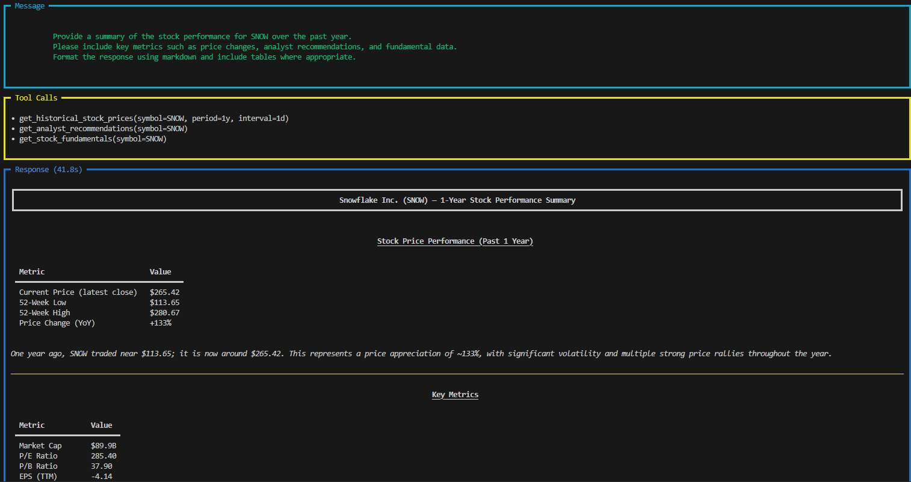

# Cookbook with Agno OS

Welcome to the cookbook section! 
Here you will find examples which shows the functionality of this MCP server with **Agno OS** as client tool.

## Setup

### Create and activate a virtual environment

```shell
uv venv cookbook

# bash
source cookbook/bin/activate

#powershell
.venv/scripts/activate

```

### Install libraries

```shell
uv pip install -U openai agno
```

### Configure LLM for the agent (OpenAI)

Run the following command to create a .env file.
Add your Open AI API key to the file.

```bash
cp template.env .env
# Edit .env with your Open AI API key
```

## Run a cookbook

```shell
python cookbook/example_agno_os.py
```

## Demo



